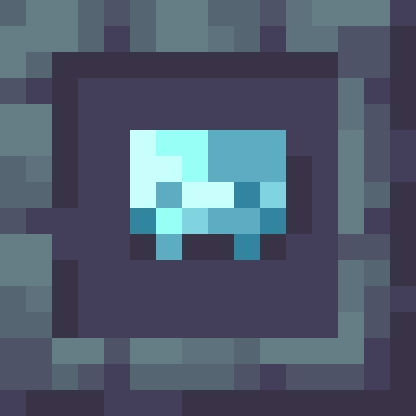

## Hidden Realm

This mod adds new hidden realm: Silent Bazaar, new items and enemies. Find the new underground structure: Moonshrine and open a portal to the new dimension, where you can trade your lunar coins with items. Get lunar coins by defeating new moonblessed enemies, or find coin pouches in structures around the world.

This mod is in active development, some of the features might feel incomplete. Future plans for this mod include configurability for modpack authors, new challenging dimensions, fixing and tweaking.

 
